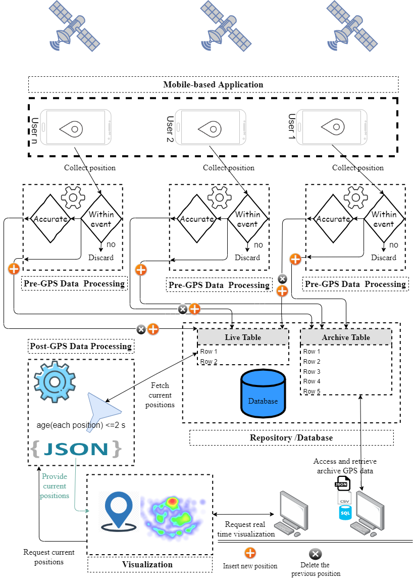
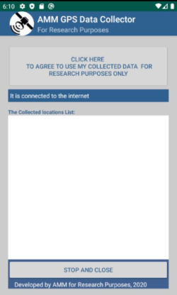

# GPSdataColVis 
### Introduction
The repository contains the source code of **GPSdataColVis** system that has been developed by our paper:

 
```
A Alia, M Maree, M Chraibi.(2021). On the exploitation of GPS-based data for real-time visualisation
of pedestrian dynamics in open environments. Behaviour & Information Technology, 1-15.
```
 
GPSdataColVis system is a hybrid android-based mobile application and web-based application that has capabilities to collect, process, store and visualize the GPS data of the users’ current positions in real time at large-scale open environments.  

---
### The architicture of the system
The following figure illustrates the overall architecture
of the proposed system.
<p align="center"></p>

### Features
1. The system (android-based mobile application) finds  pedestrians’ GPS data every second and estimates their horizontal accuracy before sending this data to the web server for further processing and storing.
2. The system provides access to online real-time visualised maps that depict pedestrian movements along with real-time heat maps for spotting crowded areas.
3.	An archive of collected GPS data with multiple formats (SQL, JSON, CSV).
---
### Data 
Each  user’s position contains the following fields:

1. Id: a unique identifier for  position.
2. mobileId: an identifier for  mobile/user.
3. Latitude: latitude of  user’s position.
4. Longitude: longitude of  user’s position.
5. Timestamp: date and time for  obtained position.
6. Accuracy: horizontal accuracy of  user’s position.
---
### System Requirements
1. A hosted web server with the following specifications to host and run the Web-based application:  
   - The web server running PHP (at least V. 7) and MySQL database.
   - It has public IP or domain for the web-based application.  
   - Web hosting servers offer cPanel which allows you to manage and control the web-based application over the Web easily and in simple way. 
2. Android Development Environment to add the domain(URL) of web-based application to android-based mobile application.  
3. Android-based smartphones that support android 4.0.3 or above to install and run the android-based mobile application (Android Application package (APK)).  
---
### Installation instructions

#### 1. Clone the repository:
```
git clone https://github.com/PedestrianDynamics/GPSdataColVis.git
```

#### 2. Web-based Application
To set up the web-based application, please follow the follwing instructions:
-  Login to the cPanel for the hosted web server  using the URL, username and password that you got  from web hosting service.
-  Creating the database and its tables:
   * From database icons, click on phpMyAdmin icon.
   * If the web hosting service gives you an empty database, click on its name and copy the following SQL statements into SQL shell and click on run button to execute the SQL statements.
``` 
CREATE TABLE `current` (
  `id` int(11) NOT NULL,
  `lang` double NOT NULL,
  `lat` double NOT NULL,
  `timestamp` timestamp NOT NULL DEFAULT current_timestamp() ON UPDATE current_timestamp(),
  `androidId` varchar(60) COLLATE utf8_unicode_ci NOT NULL,
  `accuracy` double NOT NULL
) ENGINE=InnoDB DEFAULT CHARSET=utf8 COLLATE=utf8_unicode_ci;


CREATE TABLE `traces` (
  `id` int(11) NOT NULL,
  `lang` double NOT NULL,
  `lat` double NOT NULL,
  `timestamp` timestamp NOT NULL DEFAULT current_timestamp() ON UPDATE current_timestamp(),
  `androidId` varchar(60) COLLATE utf8_unicode_ci NOT NULL,
  `accuracy` double NOT NULL
) ENGINE=In
```

   Otherwisw (If the web hosting service does not give you any database), click on SQl shell and execute the following SQL statements:

``` 
CREATE DATABASE database_name;

USE database_name;

CREATE TABLE `current` (
  `id` int(11) NOT NULL,
  `lang` double NOT NULL,
  `lat` double NOT NULL,
  `timestamp` timestamp NOT NULL DEFAULT current_timestamp() ON UPDATE current_timestamp(),
  `androidId` varchar(60) COLLATE utf8_unicode_ci NOT NULL,
  `accuracy` double NOT NULL
) ENGINE=InnoDB DEFAULT CHARSET=utf8 COLLATE=utf8_unicode_ci;


CREATE TABLE `traces` (
  `id` int(11) NOT NULL,
  `lang` double NOT NULL,
  `lat` double NOT NULL,
  `timestamp` timestamp NOT NULL DEFAULT current_timestamp() ON UPDATE current_timestamp(),
  `androidId` varchar(60) COLLATE utf8_unicode_ci NOT NULL,
  `accuracy` double NOT NULL
) ENGINE=In
```
- Uploading web-based application files into a web root (public_html or WWW) directory, please follow the following instructions
  * Select files/files manager, select a web root directory from left tree.
  * Select upload files tab to upload the files of the directory GPSdataColVis\src\WebApp.
  
  
 - Configuring the Connection to MySQL Database.
   To confgure the MySQL database connection, you need to set MySQL connection information in GPSdataColVis\src\WebApp\db.php file  as follows:
   ```
   <?php
     $servername = "localhost";
     //MySQL username and password are obtained from  web hosting service or mostly from cPanel.
     $username = "Please add MySQL username"; //Kindly notice this line
     $password = "Please add MySQL password"; //Kindly notice this line
     $dbName="Please add database_name";  //Kindly notice this line

     // Create connection
     $conn = new mysqli($servername, $username, $password,$dbName);

     // Check connection
     if ($conn->connect_error) {
        die("Connection failed: " . $conn->connect_error);
     } 

   ?>
   ```
#### 2. Adding the URL of web-based application to android-based mobile application.
To add the required public URL, you need firstly to prepare the Android Development Environment, please follow the following steps:
   - Download and install android studio (It is available over Win, Mac and Linux) from the  [link](https://developer.android.com/studio).
   - Importing the GPSdataColVis\src\Android-based mobile application into android Studio:
     * Open android studio.
     * Select Import Project (Eclipse ADT, Gradle, etc.).
     * Browse to directory where you placed the android-based mobile application and click OK.
   - Adding the required public URL:
     * Open GPSdataColVis\src\AndroidMobileApp\app\src\main\java\com\example\amm\ BackgroundTask.java file.
     * On line 30, please add the domain/URL of the web-based application
     
      ```
      String url1=  "add the domain of the web-based application here/insertLocation.php";
      ```
   - Build and run the android-based mobile application, for more information,  please visit the [link](https://developer.android.com/studio/run).
   - Generatong an APK file that can easily be installed on any Android device, to do that please follow these steps:
     * In the Android menu, go to Build > Build Bundle(s) / APK (s) > Build APK(s).
     * Android Studio will start building the APK for you. Once done, a pop-up on the bottom right will notify you of its completion. Click the ‘locate’ button in this dialog.
     * The ‘locate’ button should open File Explorer with the debug folder open that contains a file called “app-debug.apk”.

#### 3. Installing the APK file on android-based smartphones that support android 4.0.3 or above.
  - Install the APK file on android-based smartphones.
  - Open the Android-based mobile application, and follow the instructions from the android-based mobile application.
  - Click on the agreement button to start collecting and submitting GPS data of user position to the web-based application.
---
### The screenshot of android-based mobile application

<p align="center"></p>

---

### Real Dataset
A real-world experimental scenario was conducted to evaluate the proposed system, and the collected GPS data is available in GPSdataColVis\Datasets with different formats, the above data section explains the fields of each row in the dataset. 

The experiment was conducted in several open areas at the new campus at An-Najah National University in Palestine. The focus was on the open theatre area. The area of the new campus is about 137.000 square meters, and its bounding box is identified by the following latitude and longitude: (32.22682, 35.22493), (32.2294, 35.2196). Both an open area with no high buildings and another open area that is surrounded by high buildings were selected. Nine users with different types of android-based smartphones have installed the application and participated in this experimet.
 
 ---
### Citation
If you use GPSdataColVis or the real dataset, please cite the following paper:
  ```
@article{alia2021exploitation,
  title={On the exploitation of GPS-based data for real-time visualisation of pedestrian dynamics in open environments},
  author={Alia, Ahmed and Maree, Mohammed and Chraibi, Mohcine},
  journal={Behaviour \& Information Technology},
  pages={1--15},
  year={2021},
  publisher={Taylor \& Francis}
}
```
      
